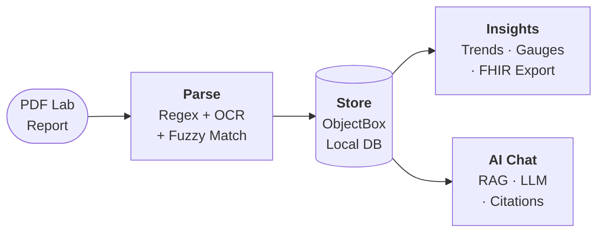
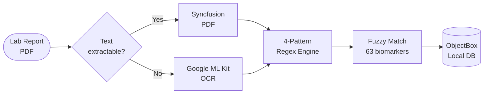
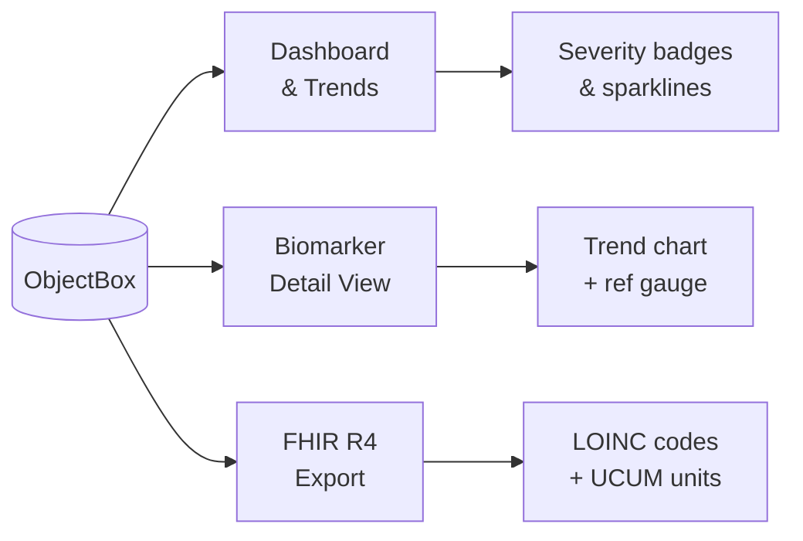
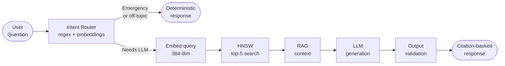

# Koshika — कोशिका

> *Your health data lives in your cell, not the cloud.*


<!-- TODO: Add screenshot strip (3 device frames side by side) -->
<!-- TODO: Add demo GIF (import PDF → dashboard → AI chat) -->

Koshika turns your PDF lab reports into actionable health insights — parsed, tracked, and explained by AI — entirely on your phone. No cloud. No accounts. No data leaves your device. Ever.

**[Website](https://www.koshika.life)**&ensp;·&ensp;**[Download](#getting-started)**&ensp;·&ensp;**[Contributing](#contributing)**

---

## Why?

200+ million Indians get blood tests every year. They receive PDF reports filled with cryptic abbreviations and reference ranges they can't interpret. Every existing solution either can't parse these formats or requires uploading private health data to a server.

Unlike cloud health apps, **Koshika never uploads your data.**
Unlike PDF readers, **it actually understands your lab values.**

---

## What it does

- **Parses any Indian lab PDF** — 4 regex patterns + fuzzy matching + OCR fallback. Works with Thyrocare, Dr. Lal, SRL, Metropolis, and more.
- **Tracks 63 biomarkers** across 10 categories with trend charts, reference gauges, and borderline detection.
- **On-device AI chat** — ask questions about your results, get citation-backed answers grounded in your actual lab values. Full RAG pipeline, entirely offline.
- **Exports to FHIR R4** — share standardized health data with any FHIR-compatible system.

---

## Quick Start

```bash
git clone https://github.com/priyavratuniyal/koshika.git
cd koshika
flutter pub get
dart run build_runner build --delete-conflicting-outputs
flutter run
```

Base features (parsing, trends, export) work immediately. AI chat is optional — download a model (~230 MB–1 GB) from Settings when you want it.

---

## How it Works



### 1. PDF Import & Parsing



PDFs are parsed on-device using text extraction or OCR, then run through a multi-pattern regex engine that fuzzy-matches results against a LOINC-coded biomarker dictionary.

### 2. Insights & Export



Parsed data powers trend charts with reference ranges, borderline detection (values within 10% of boundaries), and FHIR-compliant export for sharing with doctors or other systems.

### 3. On-Device AI Chat



Questions go through two-stage intent routing (regex prefilter + embedding classifier), then a RAG pipeline searches your lab values semantically and generates grounded, citation-backed responses. 4 curated GGUF models (360M–1B) or bring your own. Safety gates catch emergencies, hallucinations, and prohibited content before anything reaches the user.

> **[Full architecture docs →](https://www.koshika.life)**

---

<details>
<summary><strong>Features in detail</strong></summary>

### PDF Parsing Engine
- Hybrid extraction: digital text (Syncfusion) with OCR fallback (Google ML Kit)
- 4 regex patterns: space-delimited, colon-separated, pipe-separated, loose catch-all
- Fuzzy term matching normalizes lab naming ("FASTING SUGAR" → "Glucose, Fasting")
- 63 biomarker definitions across 10 categories with LOINC codes
- Section header detection (40+ variations), multiline handling, OCR artifact cleanup

### On-Device AI
- Multi-model: SmolLM2 360M · Qwen3 0.6B · Llama 3.2 1B · Gemma 3 1B (or any GGUF)
- RAG: bge-small-en-v1.5 embeddings (384-dim) + HNSW vector index → semantic search → citation-backed responses
- Two-stage routing: deterministic regex prefilter + embedding centroid classifier
- Safety: emergency escalation (17 patterns), hallucination detection, repetition/garbled detection, off-topic refusal
- Conversation history with anaphora resolution ("is that normal?" after lab query)

### Dashboard & Trends
- Clinical status overview with severity badges (Stable, Borderline, Critical)
- Interactive trend charts with reference range bands and color-coded data points
- Reference range gauge with low/normal/high zones
- Borderline detection (within 10% of reference boundaries)

### Privacy & Export
- All processing on-device: parsing, OCR, LLM, embeddings, vector search
- FHIR R4 Bundle export with LOINC codes and UCUM units
- Full and Lite app flavors (Lite = no AI, no model downloads)
- No accounts, no telemetry, no analytics

</details>

<details>
<summary><strong>Tech stack</strong></summary>

| Layer | Technology |
|-------|-----------|
| Framework | Flutter (Dart >=3.9.2) |
| Local DB | ObjectBox 5.2 (HNSW vector indexing) |
| PDF | syncfusion_flutter_pdf |
| OCR | google_mlkit_text_recognition + pdfx |
| LLM | llamadart (llama.cpp, GGUF, ChatML) |
| Embeddings | bge-small-en-v1.5 (384-dim, HNSW) |
| Charts | fl_chart |
| Export | fhir_r4 |

</details>

<details>
<summary><strong>Project structure</strong></summary>

```
lib/
├── constants/    # Prompts, templates, budgets, strings
├── models/       # 11 ObjectBox entities + data classes
├── screens/      # 8 screens
├── services/     # 23 services (PDF, AI, storage, export)
├── theme/        # Design system (typography, colors, spacing)
├── widgets/      # 10 reusable components + 6 settings widgets
├── main.dart     # App entry + routing
├── main_full.dart
└── main_lite.dart
```

</details>

---

## Roadmap

**Shipped:** PDF parsing · OCR fallback · 63 biomarkers · trend charts · borderline detection · FHIR R4 export · on-device LLM (4 models + BYOM) · semantic search · RAG with citations · two-stage intent routing · output validation · emergency detection · persistent chat · onboarding · Full/Lite flavors

**Next:**
- [ ] Health Connect integration (steps, heart rate, SpO2)
- [ ] Computed risk scores (FIB-4, eGFR, APRI)
- [ ] Anomaly detection (EWMA, personal baselines)
- [ ] Encrypted storage with biometric lock
- [ ] Web platform

---

## Contributing

Pull requests welcome. If you find a lab format the parser can't handle, open an issue with a redacted sample PDF.

```bash
npm install          # set up pre-commit formatting hook
flutter test         # run test suite
flutter analyze      # static analysis
```

Use conventional commits: `feat(scope):` · `fix(scope):` · `refactor(scope):`

---

## License

[MPL-2.0](LICENSE)
