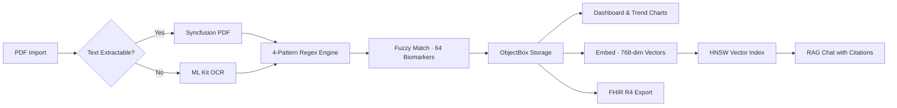

# Koshika — कोशिका

*Hindi for "cell" — your health data lives in yours, not the cloud.*


Koshika extracts biomarker data from PDF lab reports, tracks trends over time, and lets you discuss results with an on-device AI — all without a single byte leaving your phone.

<!-- Replace with actual screenshots when ready -->
<!-- <p align="center">
  
  
  
  
</p> -->

---

## The Problem

Over 200 million Indians get blood tests every year from labs like Thyrocare, Dr. Lal PathLabs, SRL, and Metropolis. Results arrive as unstructured PDFs filled with cryptic abbreviations (SGPT, HbA1c, TSH) and reference ranges that mean nothing to most people. Every existing solution either can't parse these formats or requires uploading private health data to a cloud server.

**Koshika's approach:**

- **Parses locally.** A 4-pattern regex engine + fuzzy matching handles the formatting chaos of Indian lab PDFs — directly on your device.
- **Understands your data.** 64 biomarkers normalized to a standard dictionary, flagged against reference ranges, tracked historically with trend charts.
- **Runs AI on-device.** Gemma 3 1B runs inference locally via MediaPipe. Ask questions about your reports and get citation-backed answers grounded in your actual lab values.
- **Never phones home.** No accounts, no telemetry, no cloud sync. ObjectBox database lives on your device, period.

> Turn on airplane mode. Import a PDF. Ask the AI about your cholesterol. Everything works.

---

## How It Works



PDFs are parsed on-device using text extraction (or OCR for scanned reports), then run through a multi-pattern regex engine that fuzzy-matches results against a LOINC-coded biomarker dictionary. Parsed data powers trend charts, an AI chat grounded in your actual lab values, and FHIR-compliant export.

---

## Two-Tier Architecture

The app ships as a lightweight base with an optional AI layer — download only what you need.

|  | Base Layer | AI Layer |
|---|---|---|
| **Size** | ~15 MB (app install) | +555 MB LLM, +183 MB embeddings |
| **Capabilities** | PDF parsing, biomarker extraction, trend charts, FHIR export | On-device chat, semantic search, RAG pipeline |
| **Works offline?** | Immediately | After one-time model download |
| **Required?** | Yes | Optional |

The base layer handles everything most users need. The AI layer downloads Gemma 3 1B (555 MB) and EmbeddingGemma 300M (183 MB) once over Wi-Fi, then runs entirely on-device forever.

---

## Features

### PDF Parsing
- Text extraction via Syncfusion Flutter PDF with OCR fallback (Google ML Kit) for scanned reports
- 4 regex patterns: space-delimited, colon-separated, pipe-delimited, and loose catch-all
- Fuzzy term matching normalizes lab-specific naming across 64 biomarker definitions in 10 categories (CBC, Lipid Panel, Liver, Kidney, Thyroid, Diabetes, Vitamins, Iron Studies, Electrolytes, Inflammation)
- Every biomarker mapped to a LOINC code for interoperability

### On-Device AI
- **Gemma 3 1B IT** (555 MB, int4) — streaming token-by-token responses via flutter_gemma + MediaPipe
- **EmbeddingGemma 300M** (183 MB) — 768-dimensional vectors for semantic search
- **RAG pipeline** — embeds your query, searches an HNSW vector index of your lab results, injects top matches as context, generates grounded responses with source citations `[1]`, `[2]`
- Graceful degradation — keyword search works when the embedding model isn't loaded

### Dashboard & Trends
- Health overview with biomarker count, abnormal flags, and borderline detection (within 10% of reference boundaries)
- Interactive trend charts (fl_chart) with shaded reference range bands
- Reference range gauge showing where your value falls
- Category-level health score indicators

### Privacy & Export
- Zero network dependency — all processing on-device
- FHIR R4 Bundle export (Patient + DiagnosticReport + Observations) with LOINC coding
- Native share sheet via share_plus
- No accounts, no telemetry, no analytics

---

## Tech Stack

| Component | Technology | Version |
|---|---|---|
| Framework | Flutter | SDK ^3.9.2 |
| Local DB | ObjectBox | ^5.2.0 |
| PDF Extraction | Syncfusion Flutter PDF | ^32.2.9 |
| OCR | Google ML Kit Text Recognition | ^0.13.1 |
| Text Analysis | Custom regex engine + string_similarity | ^2.0.0 |
| On-Device LLM | flutter_gemma (Gemma 3 1B IT, MediaPipe) | ^0.12.5 |
| Embeddings | EmbeddingGemma 300M (HNSW vector index) | — |
| Charts | fl_chart | ^0.70.2 |
| FHIR Export | fhir_r4 | ^0.5.1 |

**By the numbers:** 40 Dart files · 15 services · 5 widgets · 8 screens · 64 biomarker definitions · 10 medical categories · 4 regex patterns · 768-dim embeddings

---

## Project Structure

```text
lib/
├── models/          # 5 ObjectBox entities (Patient, LabReport, BiomarkerResult, ChatSession, ChatMessage)
├── screens/         # 8 screens (Dashboard, Reports, ReportDetail, BiomarkerDetail, Chat, Settings, Onboarding, Splash)
├── services/        # 15 services
│   ├── PDF:         pdf_text_extractor, ocr_text_recognition, pdf_page_render, ocr_row_reconstructor
│   ├── Parsing:     lab_report_parser, biomarker_dictionary, pdf_import
│   ├── AI:          gemma_service, embedding_service, vector_store, chat_context_builder, citation_extractor
│   ├── Storage:     objectbox_store
│   └── Export:      fhir_export
├── widgets/         # 5 components (trend chart, gauge, flag badge, chat bubble, shimmer)
└── main.dart

assets/data/         # Biomarker dictionary (64 definitions, LOINC-coded)
```

---

## Getting Started

### Prerequisites
- Flutter SDK (Dart >=3.9.2)
- Android device or emulator (API 26+)

### Installation

```bash
git clone https://github.com/priyavratuniyal/koshika.git
cd koshika
flutter pub get
dart run build_runner build --delete-conflicting-outputs
flutter run
```

Base features work immediately after install. To enable AI chat, go to **Settings** and download the models (~740 MB total). Models auto-load on subsequent launches.

---

## Design

Light mode only — intentional. Koshika follows a **"Clinical Curator"** design philosophy: editorial authority with warmth, tonal depth over structural lines. Typography: Manrope (headlines) + Inter (body). Brand color: Deep Teal `#00342B`.

---

## Roadmap

**Shipped:** PDF parsing (4 regex patterns, OCR fallback) · fuzzy matching (64 biomarkers, 10 categories) · dashboard with trends and gauges · borderline detection · FHIR R4 export · on-device LLM (Gemma 3 1B) · semantic search (EmbeddingGemma 300M) · RAG with citations · onboarding flow

**Planned:**
- [ ] Health Connect wearable integration (steps, heart rate, SpO2)
- [ ] Computed health risk scores (FIB-4, eGFR, APRI)
- [ ] Biomarker anomaly detection (EWMA, personal baselines)
- [ ] Nutritional and lifestyle recommendations
- [ ] LLM-assisted PDF extraction fallback
- [ ] Encrypted local storage with biometric lock
- [ ] Multi-patient profile support

---

## Known Limitations

- OCR for scanned reports is experimental — accuracy varies across lab formats
- First AI model download requires ~740 MB (555 MB LLM + 183 MB embeddings); after download, everything runs offline
- The 1B-parameter on-device LLM excels at biomarker explanations and trend summaries; complex multi-step medical reasoning benefits from larger models
- Web platform is planned but not yet implemented

---

## Contributing

Pull requests are welcome. We especially welcome regex patterns for lab formats we don't yet handle — open an issue with a redacted sample PDF (all personal information removed).

When contributing, use conventional commit messages (`feat:`, `fix:`, `chore:`, `refactor:`), with each commit focused on one logical change.

### Auto-format on commit

This repo uses a Husky pre-commit hook that auto-formats staged Dart files:

```bash
npm install
```

---

## FOSS Hack 2026

Built for [FOSS Hack 2026](https://fossunited.org/hack/2026) by [Priyavrat Uniyal](https://github.com/priyavratuniyal).

On-device inference powered by Google's Gemma 3 1B IT and EmbeddingGemma 300M via MediaPipe, running locally through [flutter_gemma](https://pub.dev/packages/flutter_gemma). No cloud AI services are used. AI tools were used for code generation, debugging, and documentation. All architectural decisions were made by the developer.

---

## License

[MIT](LICENSE)
