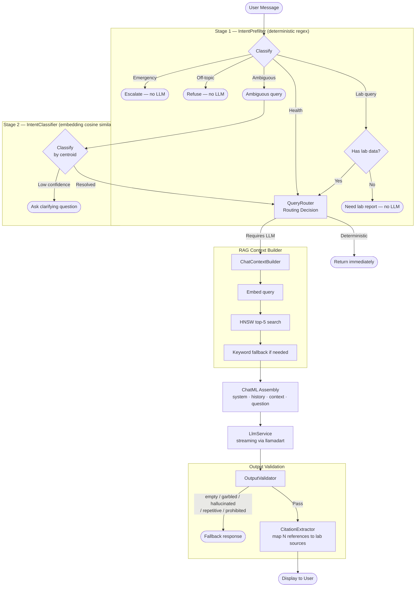

# Koshika — कोशिका


> *Your health data lives in your cell, not the cloud.*

Koshika is an offline-first, privacy-focused health app that extracts biomarker data from PDF lab reports, tracks trends over time, and lets you discuss your results with an on-device AI assistant — all without a single byte leaving your phone.

Built for the Indian pathology ecosystem: Thyrocare, SRL, Dr. Lal PathLabs, Metropolis, and more.

---

## Why Koshika?

Every year, 200+ million Indians get blood tests from pathology labs. They receive PDF reports filled with cryptic abbreviations (SGPT, HbA1c, TSH) and reference ranges they cannot interpret. Current options are: wait for a doctor, Google the values and panic, or use a cloud app that uploads private health data to remote servers.

No open-source mobile application exists that can parse Indian lab report PDFs on-device, track biomarkers over time, provide AI-powered explanations, and export data in FHIR format — all without any cloud dependency.

Koshika solves this:

- **Parses locally.** A multi-pattern regex engine + fuzzy matching handles the formatting chaos of Indian labs directly on your device. OCR fallback handles scanned/image-based pages.
- **Understands your data.** Biomarkers are normalized to a 63-definition dictionary across 10 medical categories, flagged against reference ranges (including borderline detection), and tracked historically with interactive trend charts.
- **Runs AI on-device.** Choose from 4 curated GGUF models (360M–1B params) or bring your own. Ask questions about your lab results and get citation-backed answers grounded in your actual values via a full RAG pipeline — entirely offline.
- **Never phones home.** No accounts, no telemetry, no cloud sync. ObjectBox local database. Zero network dependency.

---

## Features

### PDF Parsing Engine
- Extracts structured data from digital PDFs using Syncfusion
- **Hybrid extraction**: digital text first, OCR fallback for scanned/image-heavy pages via Google ML Kit
- 4 regex patterns (space-delimited, colon-separated, pipe-separated, loose catch-all) handle diverse lab formats
- Section header detection (40+ variations across CBC, Thyroid, Lipid Profile, LFT, KFT, etc.)
- Fuzzy term matching normalizes lab-specific naming ("FASTING SUGAR" -> "Glucose, Fasting") using exact, substring, and Dice coefficient matching
- 63 biomarker definitions across 10 medical categories with LOINC codes
- Staged import progress with per-page diagnostics and clear error messaging
- Multiline test name handling, inline flag extraction, OCR artifact cleanup

### On-Device AI Assistant
- **Multi-model support** — 4 curated GGUF models via llama.cpp (`llamadart`):
  | Model | Size | Notes |
  |-------|------|-------|
  | SmolLM2 360M | ~230 MB | Smallest, fastest load, lowest RAM |
  | Qwen3 0.6B | ~639 MB | Default — balanced quality and size |
  | Llama 3.2 1B | ~770 MB | Strong instruction following |
  | Gemma 3 1B | ~1000 MB | Most capable |
- **Custom models** — bring any GGUF model via URL
- **Streaming** token-by-token responses with ChatML prompt format
- **Two-stage intent routing**:
  - Stage 1: Deterministic regex prefilter (emergency detection, off-topic refusal, lab/health classification, Hinglish support)
  - Stage 2: Embedding-based centroid classifier for ambiguous queries
- **RAG pipeline** — bge-small-en-v1.5 embeddings (384-dim) + ObjectBox HNSW vector index. Embeds your query, searches your lab results semantically, injects top-5 matches as context, generates grounded responses with `[1]`, `[2]` source citations
- **Safety gates**:
  - Emergency escalation (chest pain, stroke, suicide, overdose — 17 patterns)
  - Diagnostic language prohibition ("you have diabetes")
  - Hallucination detection (values in output not present in context)
  - Repetition and garbled output detection
  - Off-topic refusal (programming, creative writing, trivia)
- **Graceful degradation** — keyword search works seamlessly when embedding model isn't loaded
- **Conversation history** — up to 2 prior turns for anaphora resolution ("is that normal?" after "show my creatinine")
- **Persistent chat sessions** stored in ObjectBox

### Dashboard & Trends
- Clinical status overview: Healthy Standing, Minor Variances, Needs Attention, Under Review
- "Attention Needed" panel highlighting up to 3 out-of-range biomarkers
- Category-level trend cards with 4-point sparkline mini-charts and severity badges (Stable, Optimizing, Borderline, Declined, Critical)
- Clinical insights generated from biomarker patterns (trending up/down, all-normal status)
- **Biomarker detail view**: interactive `fl_chart` trend line with reference range bands, color-coded data points (green/amber/red), touch tooltips, and full history table
- **Reference range gauge**: custom-painted horizontal indicator showing value position relative to low/normal/high zones
- **Borderline detection**: values within 10% of reference boundaries flagged as borderline (amber) — reflected across the entire app

### Privacy & Export
- All processing on-device: parsing, OCR, LLM inference, embeddings, vector search
- ObjectBox local database — no network dependency
- **FHIR R4 Bundle export** with LOINC codes, UCUM units, and interpretation codes (L/H/HH/IND for borderline)
- Native share sheet integration via `share_plus`
- Two app flavors: **Full** (with AI) and **Lite** (no AI, no model downloads)

### Onboarding & UX
- Animated splash screen with branded fade/scale animation (Koshika + कोशिका)
- 3-screen onboarding carousel: Welcome (privacy focus), How It Works (PDF parsing), Privacy First (local storage)
- Glassmorphic bottom navigation bar with backdrop blur
- Material 3 design system with custom typography (Manrope headlines + Inter body)
- Custom design tokens: KoshikaTypography, KoshikaSpacing, KoshikaRadius, KoshikaElevation, KoshikaDecorations
- Shimmer loading placeholders, haptic feedback, dark/light mode support

---

## Architecture

### Tech Stack

| Layer | Technology | Details |
|-------|------------|---------|
| Frontend | Flutter | StatefulWidget, Material 3, Manrope + Inter typography |
| Local DB | ObjectBox 5.2 | NoSQL entities with HNSW vector indexing |
| PDF Extraction | syncfusion_flutter_pdf | Digital text extraction |
| OCR Fallback | google_mlkit_text_recognition + pdfx | Page rendering + on-device OCR |
| Text Analysis | Custom regex engine + string_similarity | 4-pattern parser + Dice coefficient fuzzy matching |
| On-Device LLM | llamadart (llama.cpp) | GGUF models, ChatML format, CPU inference |
| Embeddings | bge-small-en-v1.5 (384-dim) | Via llamadart, HNSW-indexed in ObjectBox |
| Charts | fl_chart | Interactive line charts with reference bands |
| Export | fhir_r4 | FHIR R4 Observation/DiagnosticReport/Bundle |

### AI Pipeline



### Token Budget (optimized for 1B-param models)

| Slot | Tokens | Characters |
|------|--------|------------|
| System prompt | 300 | 1,200 |
| Conversation history | 200 | 800 |
| Lab context | 400 | 1,600 |
| User message | 100 | 400 |
| Generation headroom | 500 | reserved |
| **Hard limit** | **1,500** | **6,000** |

### Project Structure

```
lib/
├── constants/           # AI prompts, intent examples, token budgets, response templates
│   ├── ai_prompts.dart
│   ├── intent_examples.dart
│   ├── token_budgets.dart
│   ├── response_templates.dart
│   ├── validation_strings.dart
│   └── llm_strings.dart
├── models/              # ObjectBox entities + data classes
│   ├── patient.dart              # Patient entity
│   ├── lab_report.dart           # LabReport entity (ToOne<Patient>)
│   ├── biomarker_result.dart     # BiomarkerResult entity (384-dim HNSW embedding)
│   ├── chat_session.dart         # ChatSession + PersistedChatMessage entities
│   ├── chat_message.dart         # Ephemeral chat message (session-only)
│   ├── llm_model_config.dart     # Model registry (4 curated + custom GGUF)
│   ├── model_info.dart           # Model lifecycle state tracking
│   ├── query_decision.dart       # PrefilterResult, QueryDecision, QueryRouteResult
│   ├── retrieval_result.dart     # RAG search result with metadata
│   ├── strictness_mode.dart      # Policy mode enum (strictHealthOnly, labOnly, healthPlusWellness)
│   └── models.dart               # Barrel export
├── screens/             # 8 screens
│   ├── splash_screen.dart          # Animated init + service bootstrap
│   ├── onboarding_screen.dart      # 3-page first-launch flow
│   ├── dashboard_screen.dart       # Health overview + trends + insights
│   ├── reports_screen.dart         # PDF import + report list + FHIR export
│   ├── report_detail_screen.dart   # Per-report biomarker breakdown
│   ├── biomarker_detail_screen.dart # Trend chart + gauge + history
│   ├── chat_screen.dart            # AI chat (6-state: download/load/chat)
│   └── settings_screen.dart        # Model management + data controls
├── services/            # 23 services
│   ├── pdf_text_extractor.dart       # Hybrid digital + OCR extraction
│   ├── pdf_page_render_service.dart  # PDF page -> PNG for OCR
│   ├── ocr_text_recognition_service.dart # Google ML Kit bridge
│   ├── ocr_row_reconstructor.dart    # OCR geometry -> tabular rows
│   ├── lab_report_parser.dart        # 4-pattern regex parser
│   ├── biomarker_dictionary.dart     # 63 definitions + fuzzy matching
│   ├── pdf_import_service.dart       # End-to-end import orchestrator
│   ├── objectbox_store.dart          # DB singleton (5 boxes)
│   ├── llm_service.dart              # GGUF model lifecycle + streaming generation
│   ├── llm_embedding_service.dart    # bge-small-en-v1.5 embedding model
│   ├── vector_store_service.dart     # HNSW semantic search over biomarkers
│   ├── chat_context_builder.dart     # Semantic + keyword hybrid context builder
│   ├── query_router.dart             # Two-stage intent routing orchestrator
│   ├── intent_prefilter.dart         # Stage 1: deterministic regex classifier
│   ├── intent_classifier.dart        # Stage 2: embedding centroid classifier
│   ├── output_validator.dart         # Post-generation quality gates
│   ├── citation_extractor.dart       # [N] citation mapping + source footer
│   ├── fhir_export_service.dart      # FHIR R4 Bundle builder
│   ├── model_downloader.dart         # HTTP download with resume + HF auth
│   ├── hf_token_service.dart         # Hugging Face token management
│   ├── haptic_feedback_service.dart  # Centralized haptic feedback
│   ├── extraction_diagnostics.dart   # Import progress + failure enums
│   └── error_classifier.dart         # Error categorization
├── theme/               # Design system
│   ├── koshika_design_system.dart    # Typography, spacing, radius, elevation, decorations
│   └── app_colors.dart               # Color palette
├── utils/
│   └── error_classifier.dart
├── widgets/             # 10 reusable components
│   ├── chat_message_bubble.dart      # Role-styled bubbles + streaming dots
│   ├── biomarker_trend_chart.dart    # fl_chart line chart with ref bands
│   ├── reference_range_gauge.dart    # Custom-painted horizontal gauge
│   ├── dashboard_summary_card.dart   # Gradient hero summary card
│   ├── flag_badge.dart               # Single-letter flag indicator (N/B/L/H/C)
│   ├── status_badge.dart             # Icon + label status pill
│   ├── koshika_card.dart             # Reusable card with decoration variants
│   ├── icon_container.dart           # Colored icon background
│   ├── shimmer_loading.dart          # Animated shimmer placeholders
│   ├── trend_line_painter.dart       # Sparkline custom painter
│   └── settings/                     # 6 settings-specific widgets
│       ├── model_picker_section.dart
│       ├── embedding_model_tile.dart
│       ├── hf_token_tile.dart
│       ├── custom_model_dialog.dart
│       ├── settings_row.dart
│       └── section_header.dart
├── main.dart            # App entry, theme config, routing, bottom nav
├── main_full.dart       # Full flavor (AI enabled)
└── main_lite.dart       # Lite flavor (no AI)

assets/data/
└── biomarker_dictionary.json   # 63 biomarker definitions, 10 categories
```

### Data Model

```
Patient (1)
  └── (1:N) LabReport
                └── (1:N) BiomarkerResult
                           └── embedding: Float32[384] (HNSW-indexed)

ChatSession (1)
  └── (1:N) PersistedChatMessage
```

**Key entities:**
- `Patient` — id, name, dateOfBirth, sex
- `LabReport` — labName, reportDate, pdfPath, extractedCount, totalDetected, rawText
- `BiomarkerResult` — biomarkerKey, displayName, value, unit, refLow, refHigh, flag (normal/low/high/critical/borderline/unknown), loincCode, category, testDate, 384-dim embedding vector
- `ChatSession` / `PersistedChatMessage` — persistent conversation history

---

## Getting Started

### Prerequisites
- Flutter SDK (Dart >=3.9.2)
- Android device or emulator (API 26+)
- ~15 MB for base app, +230 MB to +1 GB for AI model (optional download)

### Installation

```bash
git clone https://github.com/priyavratuniyal/koshika.git
cd koshika
flutter pub get
dart run build_runner build --delete-conflicting-outputs
flutter run
```

### Run Variants

```bash
# Full (default) — includes AI chat, model download, RAG
flutter run -t lib/main_full.dart

# Lite — no AI, no model downloads, just parsing + charts
flutter run -t lib/main_lite.dart
```

### Auto-format on commit

This repo uses a Husky pre-commit hook that auto-formats staged Dart files:

```bash
npm install
```

### Running Tests

```bash
flutter test
```

10 test files covering:
- PDF text extraction and import
- Lab report parsing
- OCR row reconstruction
- Biomarker result model
- FHIR export service
- Model info
- Intent prefilter
- Output validator
- Query router

---

## CI/CD

GitHub Actions CI pipeline runs on every push to `main` and every pull request:

1. Install dependencies (`flutter pub get`)
2. Verify formatting (`dart format --set-exit-if-changed`)
3. Regenerate ObjectBox bindings (`build_runner`)
4. Static analysis (`flutter analyze`)
5. Run tests (`flutter test`)

---

## Supported Lab Formats

The parser is tested against and handles formats from:
- Thyrocare
- Dr. Lal PathLabs
- SRL Diagnostics
- Metropolis Healthcare

The multi-pattern regex engine handles: space-delimited columns, colon-separated values, pipe-separated tables, and loose catch-all patterns. Section headers are detected for 40+ variations (CBC, Complete Blood Count, Thyroid Profile, Lipid Panel, LFT, KFT, etc.).

OCR fallback is available for scanned/image-based pages but accuracy varies across lab formats.

---

## Roadmap

- [x] PDF parsing with multi-pattern regex engine
- [x] OCR fallback for scanned reports
- [x] Fuzzy biomarker matching (63 definitions, 10 categories)
- [x] Dashboard with health overview, trend indicators, and clinical insights
- [x] Biomarker detail view with interactive trend charts and reference gauges
- [x] Borderline detection (10% margin flagging)
- [x] FHIR R4 export with LOINC codes
- [x] On-device LLM chat (multi-model GGUF via llama.cpp)
- [x] Custom GGUF model support (bring your own)
- [x] Semantic search with bge-small-en-v1.5 (384-dim, HNSW)
- [x] Full RAG pipeline with citation-backed responses
- [x] Two-stage intent routing (regex + embedding classifier)
- [x] Output validation (hallucination, repetition, garbled, prohibited content)
- [x] Emergency detection and urgent escalation
- [x] Persistent chat sessions
- [x] Animated splash screen and onboarding flow
- [x] Settings with model picker, embedding controls, HF token management
- [x] Full / Lite app flavors
- [ ] Health Connect wearable integration
- [ ] Computed health risk scores (FIB-4, eGFR, APRI)
- [ ] Biomarker anomaly detection (EWMA, personal baselines)
- [ ] Nutritional and lifestyle recommendations
- [ ] LLM-assisted PDF extraction fallback
- [ ] Encrypted local storage with biometric lock
- [ ] Multi-patient profile support
- [ ] Web platform (Flutter Web)

---

## Known Limitations

- OCR for scanned reports is experimental — accuracy varies across lab formats
- Web platform is planned but not yet implemented
- On-device LLMs (360M–1B params) are best suited for simple explanations; complex medical reasoning has limits inherent to model size
- CPU-only inference on Android (no GPU acceleration configured)
- English-only UI (Hinglish queries are supported in intent routing)

---

## Contributing

Pull requests are welcome.

If you find a lab report format that the parser fails to handle, please open an issue with a redacted sample (remove personal information) or contribute a regex pattern.

When contributing:
- Use conventional commit messages: `feat(scope):`, `fix(scope):`, `refactor(scope):`, `chore:`, `test:`, `docs:`
- Each commit should be focused on one logical change
- Ensure `dart format`, `flutter analyze`, and `flutter test` pass

---

## License

[MPL-2.0](LICENSE)
